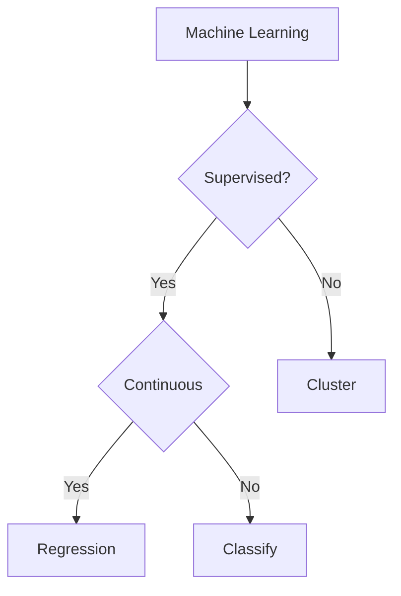

# Basic concept

## 1. Classify of machine learning questions



## 2. Generic machine learning algorithms

1. Linear Regression
2. Logistic Regression/Classify
3. KNN Classify
4. Naive Bayes Classify
5. Decision Tree Classify
6. SVM(Support vector machine) Classify
7. K-means Cluster
8. Neural Network Classify


## 3. Basic Scikit-Learn Libraries
- linear_model
- neighbors
- naive_bayes
- tree
- svm
- neural_network

## 4. Measurement indicator of performance

Basic concepts of models
> TP: True Positive, the prediction of outcome is positive, and fit with the facts -> the facts is positive<br/>
> TN: True Negative, the prediction of outcome is negative, and fit with the facts -> the facts is negative<br/>
> FP: False Positive, the prediction of outcome is positive, but not tally with the facts -> the facts is negative<br/>
> FN: False Negative, the prediction of outcome is negative, but not  tally with the facts -> the facts is positive

1. Accuracy 

```tex
\frac{TP + TN}{TP + FN + FP + TN}
```

2. Precision 

```tex
\frac{TP}{TP + FP}
```

3. Recall 

```tex
\frac{TP}{TP + FN}
```